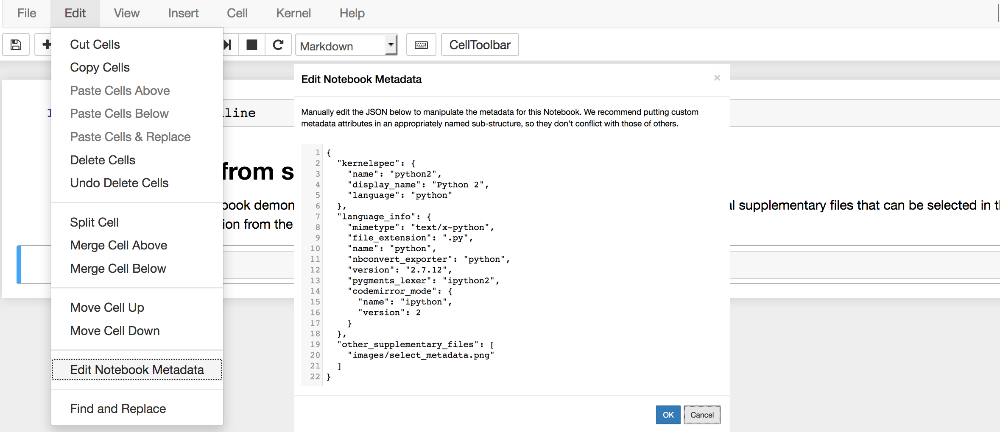
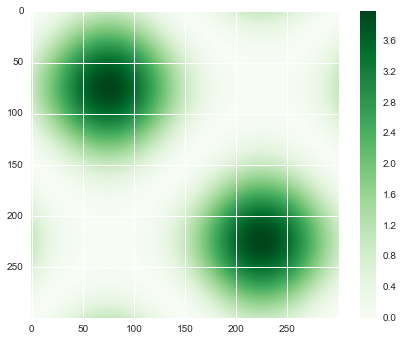

.. _gallery_examples_example_basic.ipynb:

Basic example
=============

This example notebook demonstrates as a basic example how
sphinx-nbgallery works.

You can edit the metadata of the notebook as shown in the screenshot
below and include supplementary files, select an image for displaying it
in the gallery or provide a code example.

   Edit metadata

Otherwise you can do whatever you want. You can also include ipython
magic commands, e.g ``%matplotlib inline``

which then will be (as well as all the warnings) removed in the rendered
html file of your example.

By default, the sphinx-nbgallery looks for pictures you created with
matplotlib and saved it in the notebook. If such a picture exists, it
uses the last created picture as a thumbnail in the gallery. For this
example, we modified the the ``thumbnail_figure`` key of the notebook
metadata to use our own picture (the one you see above).

.. code:: python

    import matplotlib.pyplot as plt
    import numpy as np
    import seaborn as sns

.. code:: python

    x = np.linspace(-np.pi, np.pi, 300)
    
    xx, yy = np.meshgrid(x, x)
    z = (np.sin(xx) + np.sin(yy)) ** 2
    
    plt.figure()
    plt.imshow(z, cmap='Greens')
    plt.colorbar()

.. parsed-literal::

    <matplotlib.colorbar.Colorbar at 0x11938ef98>

.. only:: html

    .. container:: sphx-glr-download

        **Download python file:** :download:`example_basic.py`

        **Download IPython notebook:** :download:`example_basic.ipynb`

        **View the notebook in the** `Jupyter nbviewer <https://nbviewer.jupyter.org/github/Chilipp/sphinx-nbexamples/blob/master/examples/example_basic.ipynb>`__
